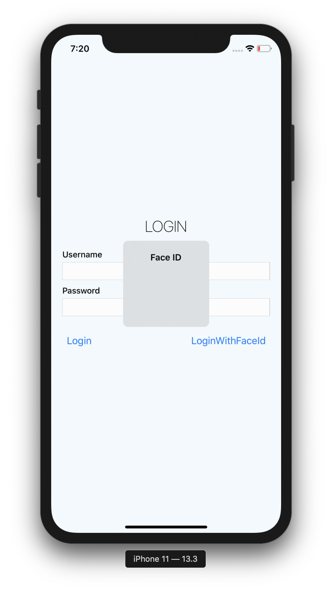

# Seniority App

To install dependencies run:

### `yarn` and `cd ios && pod install`

In the project directory, you can run:

### `yarn ios` `yarn android`

To run it on simulator/emulator

## Description

Project was bootstrapped with React Native CLI.

React Native advanced features playground:
* NativeModules, simple flag on the native side and some functions for setting and checking the value (Android and iOS)
* react-native-navigation
* react-native-keychain with react-native-touch-id for storing the sensitive data and accessing it
